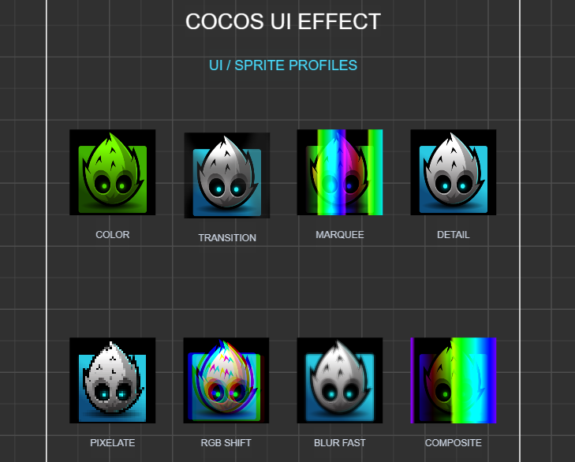

# VibeShader

[简体中文](README.zh-CN.md) | English

VibeShader is an experimental, Codex-assisted port of the well-known Unity open-source project [mob-sakai/UIEffect](https://github.com/mob-sakai/UIEffect) to Cocos Creator 3.8.

The goal is to explore how a production-oriented Unity UI shader system can be reimplemented with Cocos Creator's TypeScript components, Effect assets, materials, and editor preview workflow. This is not an official port and is not affiliated with or endorsed by the original project.



*Sprite profile showcase in the Cocos Creator sample scene.*

## Important clarification

- This repository is an experiment, not a complete one-to-one migration.
- Unity and Cocos Creator use different rendering pipelines, material systems, UI batching rules, and shader syntax. Visual output and performance may differ from the original project.
- Only the features listed below have been implemented. Do not assume compatibility with every UIEffect feature or API.
- The project was developed with Codex assistance and should be reviewed and tested before production use.
- The original UIEffect design and implementation belong to its respective authors. See [Third-Party Notices](THIRD_PARTY_NOTICES.md) and [License](LICENSE.md).

## Current implementation

### Components

- `CocosUIEffect`: applies an effect profile to a Cocos Creator `Sprite` or `Label` and previews changes in the editor.
- `CocosUIEffectTweener`: animates supported effect parameters with direction, delay, duration, easing, loop, and ping-pong controls.
- `CocosUIEffectReplica`: synchronizes effect settings from one `CocosUIEffect` component to another.
- `CocosUIEffectRuntime`: advances shared runtime time for animated effects.

### Sprite effect profiles

- Color and tone filters
- Transition and dissolve-style effects
- Marquee and gradation
- Detail texture composition
- Pixelation
- RGB shift
- Fast blur
- Composite effects

### Label effect profiles

- Color and tone filters
- Transition effects
- Marquee and gradation
- Composite effects

The repository also includes a `sample.scene` demonstrating the available Sprite and Label profiles.

## Requirements

- Cocos Creator 3.8.8

## Getting started

1. Clone this repository.
2. Open the repository folder as a project in Cocos Creator 3.8.8.
3. Open `assets/scenes/sample.scene`.
4. Run the scene or inspect the demo nodes in the editor.

To use an effect on your own node:

1. Add a `Sprite` or `Label` component.
2. Add `CocosUIEffect` to the same node.
3. Select an effect profile and adjust its exposed properties.
4. Optionally add `CocosUIEffectTweener` for animation or `CocosUIEffectReplica` to mirror another effect.

## Project structure

```text
assets/scripts/effects/                 TypeScript effect components
assets/shader/effects/ui-effect/ui/     Sprite Effect assets and materials
assets/shader/effects/ui-effect/font/   Label Effect assets and materials
assets/scenes/sample.scene              Demonstration scene
```

## Credits and license

This work is based on concepts and implementation from [mob-sakai/UIEffect](https://github.com/mob-sakai/UIEffect), Copyright 2017–2024 mob-sakai, licensed under the MIT License.

The Cocos Creator adaptation is also distributed under the MIT License. See [LICENSE.md](LICENSE.md) and [THIRD_PARTY_NOTICES.md](THIRD_PARTY_NOTICES.md) for details.
